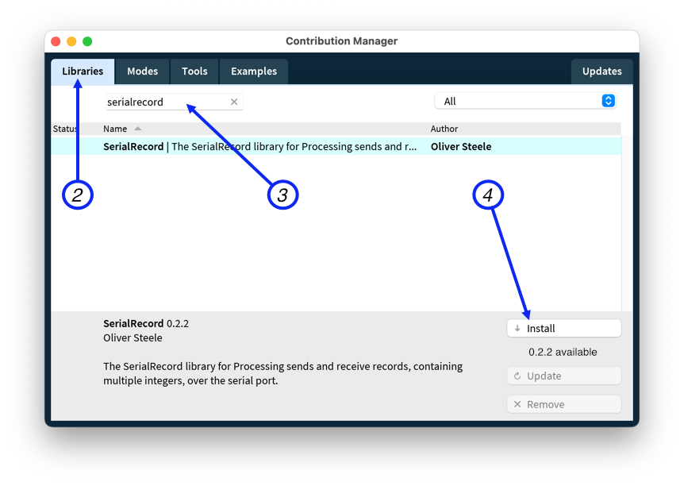

# Serial Record Library for Processing

The SerialRecord library for Processing sends and receive records, containing
multiple integers, over the serial port. It is intended for novice programmers:
it is designed to be easy to use, to detect when it is used incorrectly, and to
detect and report when it receives invalid data. It also has an option to
display the data sent to the and received from the serial port on the canvas.

The library also provides a function,
[`SerialUtils.findArduinoPort()`][findArduinoPort], that attempts to find the
serial port that the Arduino is connected to. This can be used to write sketches
that do not need to be modified when they are run on another computer, or when
the Arduino is connected to another USB port. This function can be used
independently of the other functionality in this library.

Data is sent as comma-separated ASCII. This format is easy to view and interact
with in the Arduino Serial Monitor, and is compatible with the Arduino Serial
Plotter.

The Library can be used with the [SerialRecord library for Arduino], but does
not require it.

[SerialRecord library for Arduino]: https://osteele.github.io/Arduino_SerialRecord/
[findArduinoPort]: https://github.com/osteele/Processing_SerialRecord/wiki/Find-the-Arduino-Serial-Port

## Design Goals

- Easy for novice programmers to configure and use
- Easy to inspect the transmitted data
- Detects and provides diagnostics for common errors

### Non-goals

- Efficiency. The library uses an ASCII representation of numbers. This is easy
  to visually inspect without tools, but it is computationally expensive to read
  and write, and requires more bandwidth than a binary representation.
- Flexibility. All records must have the same number of values; only integers
  are supported. The first limitation make it possible to detect errors in code
  that uses the library, but is not appropriate to all communications. If you
  need more flexibility, this is not the library for you.

## Features

- Parses sequences of integers separated by comma (CSV), tab (TSV), or space.
- Displays the most recent transmitted and received data on the canvas, as in
  the screenshot above. ([See how to disable
  this.](https://github.com/osteele/Processing_SerialRecord/wiki/Logging-Transmitted-and-Received-Data#controlling-the-display-of-transmitted-data-on-the-canvas).)
- Can be configured to log transmitted and receive data to the console. ([See
  how to enable
  this.](https://github.com/osteele/Processing_SerialRecord/wiki/Logging-Transmitted-and-Received-Data#logging-transmitted-data-to-the-console).)
- Received records that have too few or too many values result in the display of
  a warning message on the console. This can help detect issues such a mismatch
  between the number of values that the Arduino sketch sends, and the number
  that the Processing sketch expects to receive.
- When used with the [SerialRecord library for Arduino] library, sending a
  different number of values than the code running on the Arduino expects,
  results in a warning in the Processing console. This can help detect issues
  such a mismatch between the number of values that the Processing sketch sends,
  and the number that the Arduino expects to receive. (See [how this works, and
  how to make use of it in your own
  code](https://github.com/osteele/Processing_SerialRecord/wiki/Logging-Transmitted-and-Received-Data#what-is-logged).)
- Recognizes field names in records, e.g. `pot1:100,pot2:200`. This is the
  format recognized by the Arduino Serial Plotter.
- Provides a [utility
  method](https://github.com/osteele/Processing_SerialRecord/wiki/Find-the-Arduino-Serial-Port)
  that can in some circumstances (usually, on macOS) discover the name of the
  port that is used to communicate with the Arduino. This prevents someone
  running a sketch on a different computer than it was developed on, or when the
  Arduino is connected to a different USB port, from having to modify the source
  code to their sketches.
- When used with the [SerialRecord library for Arduino] library, a command can
  be used to request that the Arduino send back the values that it received, for
  debugging. This can be done once, or at periodic intervals.

## Installation

Use Processing's *Contribution Manager* to install this library:

1. From the Processing IDE's *Tools* menu, select *Manage Tools…*.
   
2. Select the *Libraries* tab.
3. Search for "serialrecord".
4. Click *Install*.

## Examples

Once the library has been installed, examples are available from the *File >
Examples* menu.

Each example is designed to pair with an example in the [SerialRecord library
for Arduino] library. However, the examples can also be used with other Arduino
sketches (so long as those sketches are written to send or receive to expected
number of values), or as a starting point for your own work.

The [Examples wiki
page](https://github.com/osteele/Processing_SerialRecord/wiki/Examples)
describes the examples, and suggests which example from the [SerialRecord
library for Arduino] is intended for use with each Processing example. (For
example, the Processing `SendSingleValue` sketch was designed to pair with the
Arduino `ReceiveSingleValue` sketch.)

## Troubleshooting

Some common problems and their solutions are described in the symptoms in
[Troubleshooting](https://github.com/osteele/Processing_SerialRecord/wiki/Troubleshooting).

## Code Recipes

The canvas display of the most-recently transmitted and received lines is
helpful during initial development, but at some point you may require a canvas
that contains only what your code explicitly draws there.

The [Code
Recipes](https://github.com/osteele/Processing_SerialRecord/wiki/Code-Recipes)
Wiki page contains recipes to disable the feature where SerialRecord displays
information on the canvas, and to log serial communication to the console
instead.

## Alternatives

It is relatively easy to transmit data between the Arduino and Processing without a library.

- [Firmata](https://github.com/firmata/arduino), which features declarative
  binding of value positions to sensors or pin numbers.
- [VSync Library](http://ernestum.github.io/VSync/) for the Arduino platform
  "magically" synchronizes Arduino and Processing variables.

## Acknowledgements

The idea of providing this code as a library was inspired by code provided to
students by the NYU Shanghai IMA "Interaction Lab" course, for them to copy and
paste into their sketches.

## License

Copyright (C) 2020-2022 Oliver Steele. This software is made available under the
terms of the GNU LGPL License.
